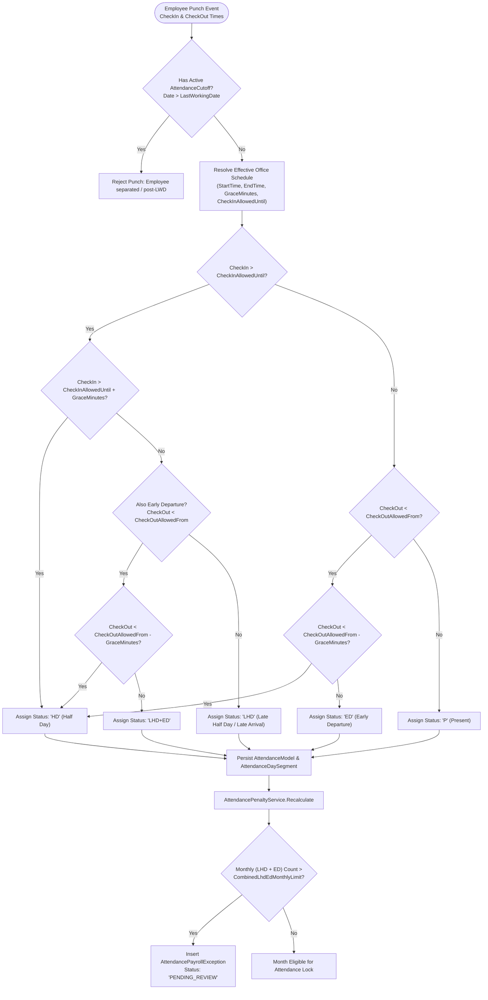

# Attendance Calculation & Exception Flow Diagram

```mermaid
flowchart TD
    Punch([Employee Punch Event\nCheckIn & CheckOut Times]) --> CutoffCheck{Has Active AttendanceCutoff?\nDate > LastWorkingDate}
    CutoffCheck -- Yes --> RejectCutoff["Reject Punch: Employee separated / post-LWD"]
    CutoffCheck -- No --> ResolveSchedule["Resolve Effective Office Schedule\n(StartTime, EndTime, GraceMinutes, CheckInAllowedUntil)"]
    
    ResolveSchedule --> CompareCheckIn{"CheckIn > CheckInAllowedUntil?"}
    CompareCheckIn -- Yes --> CheckHalfDayIn{"CheckIn > CheckInAllowedUntil + GraceMinutes?"}
    CompareCheckIn -- No --> CheckEarlyOut{"CheckOut < CheckOutAllowedFrom?"}

    CheckHalfDayIn -- Yes --> AssignHD["Assign Status: 'HD' (Half Day)"]
    CheckHalfDayIn -- No --> CheckEarlyOut_Late{"Also Early Departure?\nCheckOut < CheckOutAllowedFrom"}

    CheckEarlyOut_Late -- Yes --> CheckHalfDayOut_Late{"CheckOut < CheckOutAllowedFrom - GraceMinutes?"}
    CheckEarlyOut_Late -- No --> AssignLHD["Assign Status: 'LHD' (Late Half Day / Late Arrival)"]

    CheckHalfDayOut_Late -- Yes --> AssignHD
    CheckHalfDayOut_Late -- No --> AssignCombined["Assign Status: 'LHD+ED'"]

    CheckEarlyOut -- Yes --> CheckHalfDayOut{"CheckOut < CheckOutAllowedFrom - GraceMinutes?"}
    CheckEarlyOut -- No --> AssignP["Assign Status: 'P' (Present)"]

    CheckHalfDayOut -- Yes --> AssignHD
    CheckHalfDayOut -- No --> AssignED["Assign Status: 'ED' (Early Departure)"]

    AssignP --> SaveRecord["Persist AttendanceModel & AttendanceDaySegment"]
    AssignLHD --> SaveRecord
    AssignED --> SaveRecord
    AssignCombined --> SaveRecord
    AssignHD --> SaveRecord

    SaveRecord --> PenaltyEval["AttendancePenaltyService.Recalculate"]
    PenaltyEval --> CountLhdEd{"Monthly (LHD + ED) Count >\nCombinedLhdEdMonthlyLimit?"}
    CountLhdEd -- Yes --> RaiseException["Insert AttendancePayrollException\nStatus: 'PENDING_REVIEW'"]
    CountLhdEd -- No --> ReadyForLock["Month Eligible for Attendance Lock"]
```
