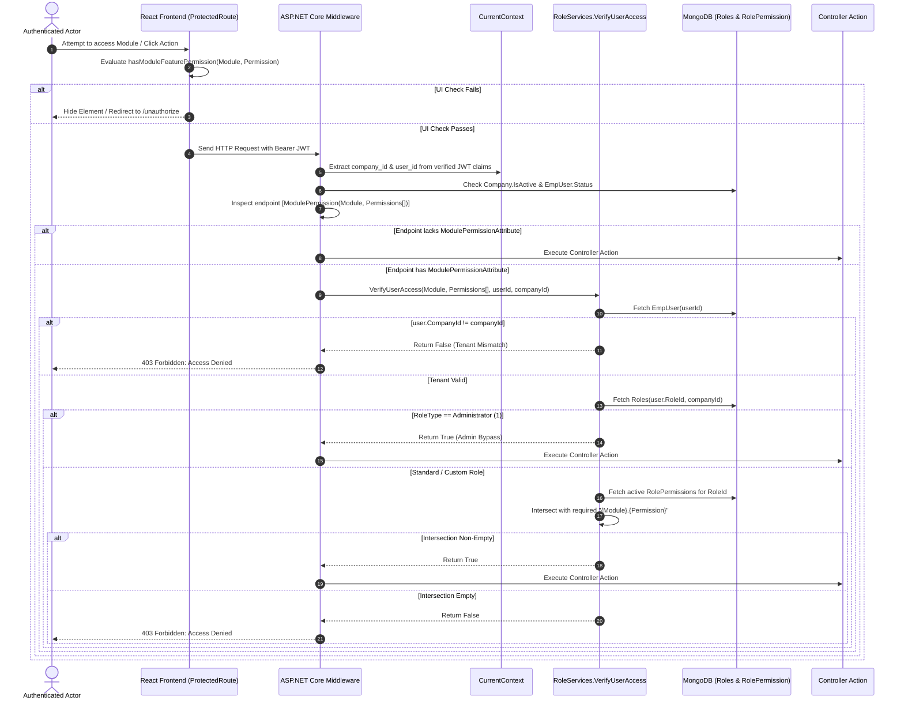

# Authorization & Permission Evaluation Flow Diagram

```mermaid
sequenceDiagram
    autonumber
    actor User as Authenticated Actor
    participant UI as React Frontend (ProtectedRoute)
    participant API as ASP.NET Core Middleware
    participant Context as CurrentContext
    participant RoleSvc as RoleServices.VerifyUserAccess
    participant Db as MongoDB (Roles & RolePermission)
    participant Action as Controller Action

    User->>UI: Attempt to access Module / Click Action
    UI->>UI: Evaluate hasModuleFeaturePermission(Module, Permission)
    alt UI Check Fails
        UI-->>User: Hide Element / Redirect to /unauthorize
    else UI Check Passes
        UI->>API: Send HTTP Request with Bearer JWT
        API->>Context: Extract company_id & user_id from verified JWT claims
        API->>Db: Check Company.IsActive & EmpUser.Status
        API->>API: Inspect endpoint [ModulePermission(Module, Permissions[])]
        alt Endpoint lacks ModulePermissionAttribute
            API->>Action: Execute Controller Action
        else Endpoint has ModulePermissionAttribute
            API->>RoleSvc: VerifyUserAccess(Module, Permissions[], userId, companyId)
            RoleSvc->>Db: Fetch EmpUser(userId)
            alt user.CompanyId != companyId
                RoleSvc-->>API: Return False (Tenant Mismatch)
                API-->>User: 403 Forbidden: Access Denied
            else Tenant Valid
                RoleSvc->>Db: Fetch Roles(user.RoleId, companyId)
                alt RoleType == Administrator (1)
                    RoleSvc-->>API: Return True (Admin Bypass)
                    API->>Action: Execute Controller Action
                else Standard / Custom Role
                    RoleSvc->>Db: Fetch active RolePermissions for RoleId
                    RoleSvc->>RoleSvc: Intersect with required "{Module}.{Permission}"
                    alt Intersection Non-Empty
                        RoleSvc-->>API: Return True
                        API->>Action: Execute Controller Action
                    else Intersection Empty
                        RoleSvc-->>API: Return False
                        API-->>User: 403 Forbidden: Access Denied
                    end
                end
            end
        end
    end
```
