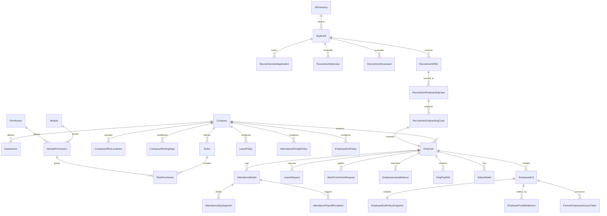

# Database Relationships Conceptual ER Diagram

```mermaid
erDiagram
    Company ||--o{ Department : defines
    Company ||--o{ Roles : defines
    Company ||--o{ CompanyOfficeLocations : operates
    Company ||--o{ CompanyWorkingDays : establishes
    Company ||--o{ EmpUser : employs
    Company ||--o{ LeavePolicy : configures
    Company ||--o{ AttendancePenaltyPolicy : configures
    Company ||--o{ EmployeeExitPolicy : configures

    Roles ||--o{ RolePermission : contains
    Module ||--o{ ModulePermission : groups
    Permission ||--o{ ModulePermission : defines
    ModulePermission ||--o{ RolePermission : grants

    EmpUser ||--o{ AttendanceModel : logs
    EmpUser ||--o{ LeaveRequest : requests
    EmpUser ||--o{ WorkFromHomeRequest : applies
    EmpUser ||--o{ EmployeeLeaveBalance : maintains
    EmpUser ||--o{ EmpPayRoll : receives
    EmpUser ||--o{ SalaryModel : has
    EmpUser ||--o{ EmployeeExit : initiates

    AttendanceModel ||--o{ AttendanceDaySegment : details
    AttendanceModel ||--o{ AttendancePayrollException : triggers

    EmployeeExit ||--|| EmployeeExitPolicySnapshot : embeds
    EmployeeExit ||--o{ EmployeeFinalSettlement : settles_via
    EmployeeExit ||--o{ FormerEmployeeAccessToken : provisions

    JobVacancy ||--o{ Applicant : attracts
    Applicant ||--o{ RecruitmentJobApplication : tracks
    Applicant ||--o{ RecruitmentInterview : schedules
    Applicant ||--o{ RecruitmentScorecard : evaluates
    Applicant ||--o{ RecruitmentOffer : receives
    RecruitmentOffer ||--o{ RecruitmentPreboardingCase : handoff_to
    RecruitmentPreboardingCase ||--o{ RecruitmentOnboardingCase : prepares
    RecruitmentOnboardingCase ||--|| EmpUser : activates
```
