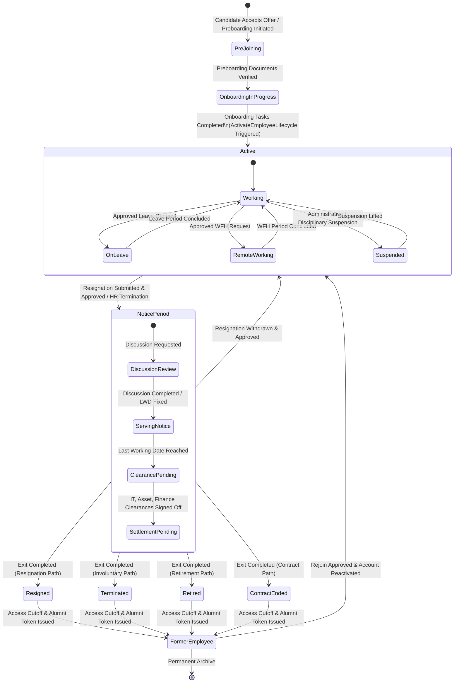

# Employee Lifecycle Master State Machine Diagram

```mermaid
stateDiagram-v2
    [*] --> PreJoining: Candidate Accepts Offer / Preboarding Initiated

    PreJoining --> OnboardingInProgress: Preboarding Documents Verified
    OnboardingInProgress --> Active: Onboarding Tasks Completed\n(ActivateEmployeeLifecycle Triggered)

    state Active {
        [*] --> Working
        Working --> OnLeave: Approved Leave Request
        OnLeave --> Working: Leave Period Concluded
        Working --> RemoteWorking: Approved WFH Request
        RemoteWorking --> Working: WFH Period Concluded
        Working --> Suspended: Administrative / Disciplinary Suspension
        Suspended --> Working: Suspension Lifted
    }

    Active --> NoticePeriod: Resignation Submitted & Approved / HR Termination
    
    state NoticePeriod {
        [*] --> DiscussionReview: Discussion Requested
        DiscussionReview --> ServingNotice: Discussion Completed / LWD Fixed
        ServingNotice --> ClearancePending: Last Working Date Reached
        ClearancePending --> SettlementPending: IT, Asset, Finance Clearances Signed Off
    }

    NoticePeriod --> Active: Resignation Withdrawn & Approved
    NoticePeriod --> Resigned: Exit Completed (Resignation Path)
    NoticePeriod --> Terminated: Exit Completed (Involuntary Path)
    NoticePeriod --> Retired: Exit Completed (Retirement Path)
    NoticePeriod --> ContractEnded: Exit Completed (Contract Path)

    Resigned --> FormerEmployee: Access Cutoff & Alumni Token Issued
    Terminated --> FormerEmployee: Access Cutoff & Alumni Token Issued
    Retired --> FormerEmployee: Access Cutoff & Alumni Token Issued
    ContractEnded --> FormerEmployee: Access Cutoff & Alumni Token Issued

    FormerEmployee --> Active: Rejoin Approved & Account Reactivated
    FormerEmployee --> [*]: Permanent Archive
```
