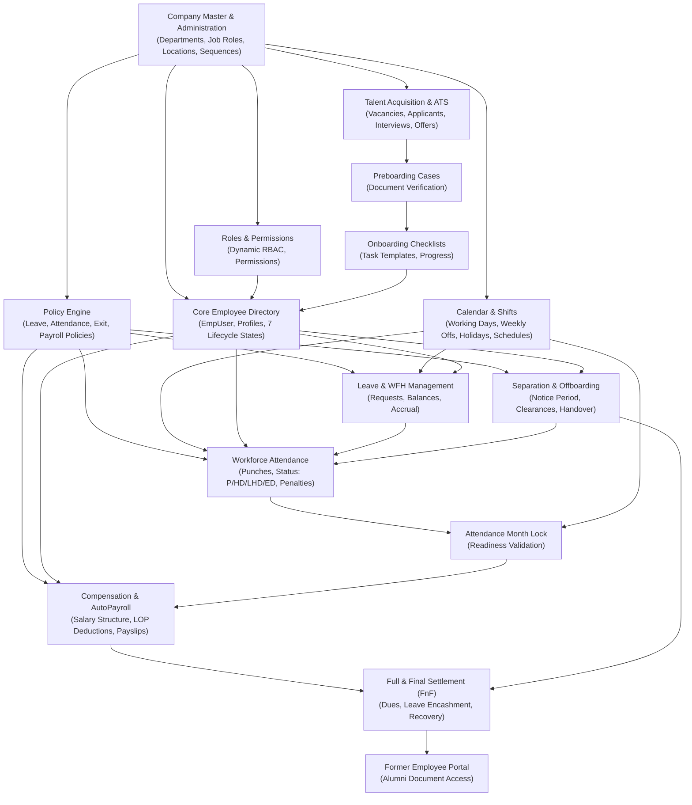

# Module Dependencies Architecture Diagram

```mermaid
graph TD
    Company["Company Master & Administration\n(Departments, Job Roles, Locations, Sequences)"]
    Roles["Roles & Permissions\n(Dynamic RBAC, Permissions)"]
    Policies["Policy Engine\n(Leave, Attendance, Exit, Payroll Policies)"]
    Calendar["Calendar & Shifts\n(Working Days, Weekly Offs, Holidays, Schedules)"]

    Recruitment["Talent Acquisition & ATS\n(Vacancies, Applicants, Interviews, Offers)"]
    Preboarding["Preboarding Cases\n(Document Verification)"]
    Onboarding["Onboarding Checklists\n(Task Templates, Progress)"]
    Employee["Core Employee Directory\n(EmpUser, Profiles, 7 Lifecycle States)"]

    Attendance["Workforce Attendance\n(Punches, Status: P/HD/LHD/ED, Penalties)"]
    LeaveWFH["Leave & WFH Management\n(Requests, Balances, Accrual)"]
    AttendanceLock["Attendance Month Lock\n(Readiness Validation)"]

    Payroll["Compensation & AutoPayroll\n(Salary Structure, LOP Deductions, Payslips)"]
    Offboarding["Separation & Offboarding\n(Notice Period, Clearances, Handover)"]
    FinalSettlement["Full & Final Settlement (FnF)\n(Dues, Leave Encashment, Recovery)"]
    Alumni["Former Employee Portal\n(Alumni Document Access)"]

    Company --> Roles
    Company --> Policies
    Company --> Calendar
    Company --> Recruitment
    Company --> Employee

    Roles --> Employee
    Policies --> LeaveWFH
    Policies --> Attendance
    Policies --> Offboarding
    Policies --> Payroll

    Calendar --> Attendance
    Calendar --> LeaveWFH

    Recruitment --> Preboarding
    Preboarding --> Onboarding
    Onboarding --> Employee

    Employee --> Attendance
    Employee --> LeaveWFH
    Employee --> Payroll
    Employee --> Offboarding

    Attendance --> AttendanceLock
    LeaveWFH --> Attendance
    Calendar --> AttendanceLock
    AttendanceLock --> Payroll

    Payroll --> FinalSettlement
    Offboarding --> Attendance
    Offboarding --> FinalSettlement
    FinalSettlement --> Alumni
```
