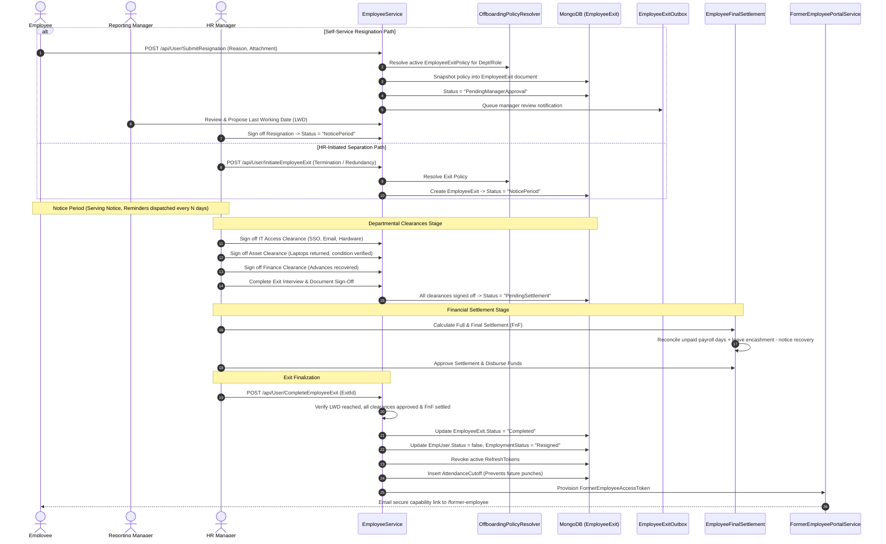

# Offboarding, Separation & Clearance Flow Diagram

```mermaid
sequenceDiagram
    autonumber
    actor Emp as Employee
    actor Mgr as Reporting Manager
    actor HR as HR Manager
    participant Service as EmployeeService
    participant Resolver as OffboardingPolicyResolver
    participant Db as MongoDB (EmployeeExit)
    participant Outbox as EmployeeExitOutbox
    participant Fnf as EmployeeFinalSettlement
    participant Portal as FormerEmployeePortalService

    alt Self-Service Resignation Path
        Emp->>Service: POST /api/User/SubmitResignation (Reason, Attachment)
        Service->>Resolver: Resolve active EmployeeExitPolicy for Dept/Role
        Service->>Db: Snapshot policy into EmployeeExit document
        Service->>Db: Status = "PendingManagerApproval"
        Service->>Outbox: Queue manager review notification
        Mgr->>Service: Review & Propose Last Working Date (LWD)
        HR->>Service: Sign off Resignation -> Status = "NoticePeriod"
    else HR-Initiated Separation Path
        HR->>Service: POST /api/User/InitiateEmployeeExit (Termination / Redundancy)
        Service->>Resolver: Resolve Exit Policy
        Service->>Db: Create EmployeeExit -> Status = "NoticePeriod"
    end

    Note over Emp,HR: Notice Period (Serving Notice, Reminders dispatched every N days)

    Note over HR,Db: Departmental Clearances Stage
    HR->>Service: Sign off IT Access Clearance (SSO, Email, Hardware)
    HR->>Service: Sign off Asset Clearance (Laptops returned, condition verified)
    HR->>Service: Sign off Finance Clearance (Advances recovered)
    HR->>Service: Complete Exit Interview & Document Sign-Off
    Service->>Db: All clearances signed off -> Status = "PendingSettlement"

    Note over HR,Fnf: Financial Settlement Stage
    HR->>Fnf: Calculate Full & Final Settlement (FnF)
    Fnf->>Fnf: Reconcile unpaid payroll days + leave encashment - notice recovery
    HR->>Fnf: Approve Settlement & Disburse Funds

    Note over HR,Service: Exit Finalization
    HR->>Service: POST /api/User/CompleteEmployeeExit (ExitId)
    Service->>Service: Verify LWD reached, all clearances approved & FnF settled
    Service->>Db: Update EmployeeExit.Status = "Completed"
    Service->>Db: Update EmpUser.Status = false, EmploymentStatus = "Resigned"
    Service->>Db: Revoke active RefreshTokens
    Service->>Db: Insert AttendanceCutoff (Prevents future punches)
    Service->>Portal: Provision FormerEmployeeAccessToken
    Portal-->>Emp: Email secure capability link to /former-employee
```
