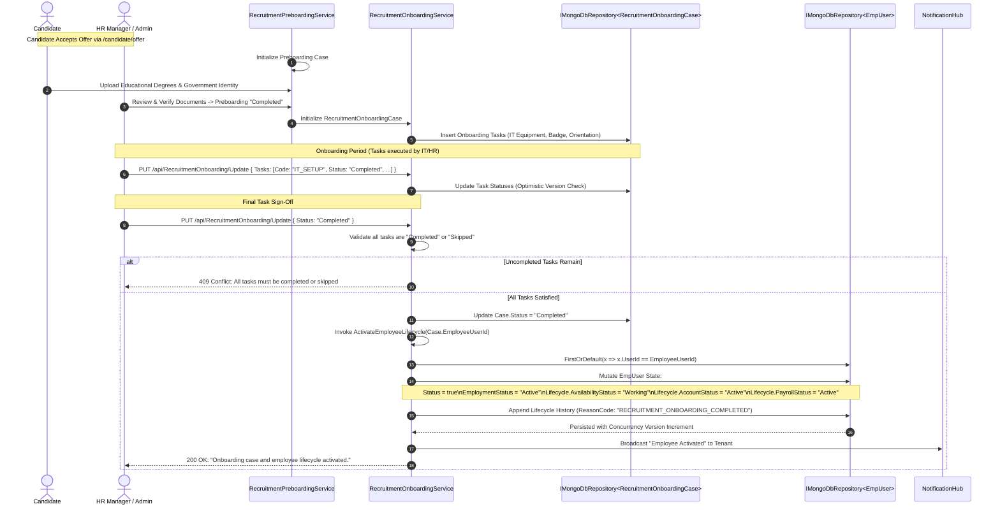

# Onboarding Lifecycle & Activation Flow Diagram

```mermaid
sequenceDiagram
    autonumber
    actor Candidate as Candidate
    actor HR as HR Manager / Admin
    participant PreSvc as RecruitmentPreboardingService
    participant OnbSvc as RecruitmentOnboardingService
    participant CaseRepo as IMongoDbRepository<RecruitmentOnboardingCase>
    participant EmpRepo as IMongoDbRepository<EmpUser>
    participant Hub as NotificationHub

    Note over Candidate,HR: Candidate Accepts Offer via /candidate/offer
    PreSvc->>PreSvc: Initialize Preboarding Case
    Candidate->>PreSvc: Upload Educational Degrees & Government Identity
    HR->>PreSvc: Review & Verify Documents -> Preboarding "Completed"
    PreSvc->>OnbSvc: Initialize RecruitmentOnboardingCase
    OnbSvc->>CaseRepo: Insert Onboarding Tasks (IT Equipment, Badge, Orientation)
    
    Note over HR,CaseRepo: Onboarding Period (Tasks executed by IT/HR)
    HR->>OnbSvc: PUT /api/RecruitmentOnboarding/Update { Tasks: [Code: "IT_SETUP", Status: "Completed", ...] }
    OnbSvc->>CaseRepo: Update Task Statuses (Optimistic Version Check)

    Note over HR,OnbSvc: Final Task Sign-Off
    HR->>OnbSvc: PUT /api/RecruitmentOnboarding/Update { Status: "Completed" }
    OnbSvc->>OnbSvc: Validate all tasks are "Completed" or "Skipped"
    alt Uncompleted Tasks Remain
        OnbSvc-->>HR: 409 Conflict: All tasks must be completed or skipped
    else All Tasks Satisfied
        OnbSvc->>CaseRepo: Update Case.Status = "Completed"
        OnbSvc->>OnbSvc: Invoke ActivateEmployeeLifecycle(Case.EmployeeUserId)
        OnbSvc->>EmpRepo: FirstOrDefault(x => x.UserId == EmployeeUserId)
        OnbSvc->>EmpRepo: Mutate EmpUser State:
        Note over OnbSvc,EmpRepo: Status = true\nEmploymentStatus = "Active"\nLifecycle.AvailabilityStatus = "Working"\nLifecycle.AccountStatus = "Active"\nLifecycle.PayrollStatus = "Active"
        OnbSvc->>EmpRepo: Append Lifecycle History (ReasonCode: "RECRUITMENT_ONBOARDING_COMPLETED")
        EmpRepo-->>OnbSvc: Persisted with Concurrency Version Increment
        OnbSvc->>Hub: Broadcast "Employee Activated" to Tenant
        OnbSvc-->>HR: 200 OK: "Onboarding case and employee lifecycle activated."
    end
```
