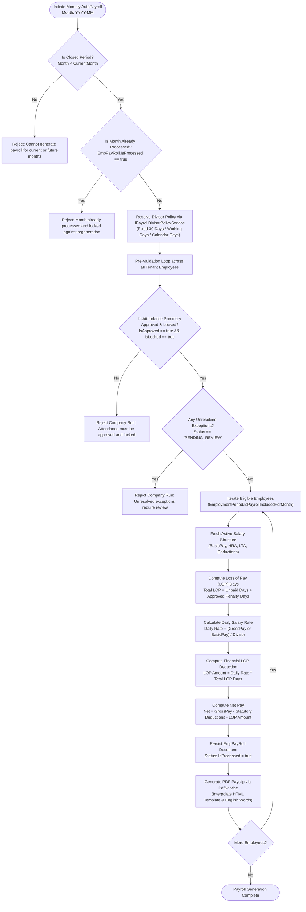

# Payroll Calculation Flow Diagram

```mermaid
flowchart TD
    Start([Initiate Monthly AutoPayroll\nMonth: YYYY-MM]) --> CheckClosed{Is Closed Period?\nMonth < CurrentMonth}
    CheckClosed -- No --> ErrorFuture["Reject: Cannot generate payroll for current or future months"]
    CheckClosed -- Yes --> CheckProcessed{Is Month Already Processed?\nEmpPayRoll.IsProcessed == true}
    CheckProcessed -- Yes --> ErrorProcessed["Reject: Month already processed and locked against regeneration"]
    CheckProcessed -- No --> ResolveDivisor["Resolve Divisor Policy via IPayrollDivisorPolicyService\n(Fixed 30 Days / Working Days / Calendar Days)"]
    
    ResolveDivisor --> ValidateAll["Pre-Validation Loop across all Tenant Employees"]
    ValidateAll --> CheckLock{Is Attendance Summary\nApproved & Locked?\nIsApproved == true && IsLocked == true}
    CheckLock -- No --> BlockValidation["Reject Company Run: Attendance must be approved and locked"]
    CheckLock -- Yes --> CheckExceptions{Any Unresolved Exceptions?\nStatus == 'PENDING_REVIEW'}
    CheckExceptions -- Yes --> BlockExceptions["Reject Company Run: Unresolved exceptions require review"]
    CheckExceptions -- No --> LoopEmployees["Iterate Eligible Employees\n(EmploymentPeriod.IsPayrollIncludedForMonth)"]

    LoopEmployees --> FetchSalary["Fetch Active Salary Structure\n(BasicPay, HRA, LTA, Deductions)"]
    FetchSalary --> CalcLOP["Compute Loss of Pay (LOP) Days\nTotal LOP = Unpaid Days + Approved Penalty Days"]
    CalcLOP --> ProrateDaily["Calculate Daily Salary Rate\nDaily Rate = (GrossPay or BasicPay) / Divisor"]
    ProrateDaily --> DeductLOP["Compute Financial LOP Deduction\nLOP Amount = Daily Rate * Total LOP Days"]
    DeductLOP --> ComputeNet["Compute Net Pay\nNet = GrossPay - Statutory Deductions - LOP Amount"]
    ComputeNet --> SavePayroll["Persist EmpPayRoll Document\nStatus: IsProcessed = true"]
    SavePayroll --> GenPayslip["Generate PDF Payslip via PdfService\n(Interpolate HTML Template & English Words)"]
    GenPayslip --> EndLoop{More Employees?}
    EndLoop -- Yes --> LoopEmployees
    EndLoop -- No --> Complete([Payroll Generation Complete])
```
