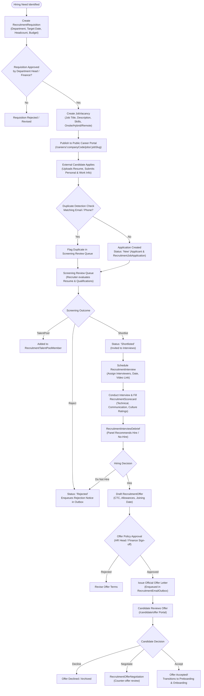

# Recruitment & Talent Acquisition Flow Diagram

```mermaid
flowchart TD
    ReqStart([Hiring Need Identified]) --> Requisition["Create RecruitmentRequisition\n(Department, Target Date, Headcount, Budget)"]
    Requisition --> ReqApproval{"Requisition Approved\nby Department Head / Finance?"}
    ReqApproval -- No --> ReqRejected["Requisition Rejected / Revised"]
    ReqApproval -- Yes --> CreateJob["Create JobVacancy\n(Job Title, Description, Skills, Onsite/Hybrid/Remote)"]
    
    CreateJob --> PublishJob["Publish to Public Career Portal\n(/careers/:companyCode/jobs/:jobSlug)"]
    PublishJob --> CandidateApp["External Candidate Applies\n(Uploads Resume, Submits Personal & Work Info)"]
    CandidateApp --> DeduplicateCheck{"Duplicate Detection Check\nMatching Email / Phone?"}
    
    DeduplicateCheck -- Yes --> FlagDuplicate["Flag Duplicate in Screening Review Queue"]
    DeduplicateCheck -- No --> NewApplication["Application Created\nStatus: 'New' (Applicant & RecruitmentJobApplication)"]

    FlagDuplicate --> Screening["Screening Review Queue\n(Recruiter evaluates Resume & Qualifications)"]
    NewApplication --> Screening

    Screening --> ScreeningDecision{"Screening Outcome"}
    ScreeningDecision -- Reject --> StageRejected["Status: 'Rejected'\nEnqueues Rejection Notice in Outbox"]
    ScreeningDecision -- TalentPool --> StageTalent["Added to RecruitmentTalentPoolMember"]
    ScreeningDecision -- Shortlist --> StageShortlist["Status: 'Shortlisted'\n(Invited to Interviews)"]

    StageShortlist --> ScheduleInterview["Schedule RecruitmentInterview\n(Assign Interviewers, Date, Video Link)"]
    ScheduleInterview --> ConductInterview["Conduct Interview & Fill RecruitmentScorecard\n(Technical, Communication, Culture Ratings)"]
    ConductInterview --> Debrief["RecruitmentInterviewDebrief\n(Panel Recommends Hire / No-Hire)"]

    Debrief --> HiringDecision{"Hiring Decision"}
    HiringDecision -- Do Not Hire --> StageRejected
    HiringDecision -- Hire --> DraftOffer["Draft RecruitmentOffer\n(CTC, Allowances, Joining Date)"]

    DraftOffer --> OfferApprovalPolicy{"Offer Policy Approval\n(HR Head / Finance Sign-off)"}
    OfferApprovalPolicy -- Rejected --> ReviseOffer["Revise Offer Terms"]
    OfferApprovalPolicy -- Approved --> IssueOffer["Issue Official Offer Letter\n(Enqueued in RecruitmentEmailOutbox)"]

    IssueOffer --> CandidateReview["Candidate Reviews Offer\n(/candidate/offer Portal)"]
    CandidateReview --> CandidateDecision{"Candidate Decision"}
    CandidateDecision -- Decline --> OfferDeclined["Offer Declined / Archived"]
    CandidateDecision -- Negotiate --> OfferNegotiation["RecruitmentOfferNegotiation\n(Counter-offer review)"]
    CandidateDecision -- Accept --> OfferAccepted["Offer Accepted!\nTransitions to Preboarding & Onboarding"]
```
