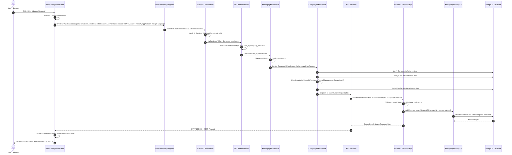

# Request-Response Lifecycle Flow Diagram

```mermaid
sequenceDiagram
    autonumber
    actor User as User / Browser
    participant React as React SPA (Axios Client)
    participant Edge as Reverse Proxy / Ingress
    participant RateLimiter as ASP.NET RateLimiter
    participant JwtAuth as JWT Bearer Handler
    participant AntiCsrf as AntiforgeryMiddleware
    participant CoMid as CompanyIdMiddleware
    participant Controller as API Controller
    participant Service as Business Service Layer
    participant Mongo as MongoRepository<T>
    participant Db as MongoDB Database

    User->>React: Click "Submit Leave Request"
    React->>React: Validate Form Fields Locally
    React->>Edge: HTTP POST /api/LeaveManagement/SubmitLeaveRequest\nHeaders: Authorization: Bearer <JWT>, XSRF-TOKEN, AppVersion, Accept-Language
    Edge->>RateLimiter: Forward Request (Preserving X-Forwarded-For)
    RateLimiter->>RateLimiter: Verify IP Partition Window (PermitLimit > 0)
    RateLimiter->>JwtAuth: Authenticate Token Signature, exp, issuer
    JwtAuth->>JwtAuth: OnTokenValidated: Verify sub == user_id, company_id != null
    JwtAuth->>AntiCsrf: Invoke AntiforgeryMiddleware
    AntiCsrf->>AntiCsrf: Check AppVersion == ConfiguredVersion
    AntiCsrf->>CoMid: Invoke CompanyIdMiddleware.AuthenticateUserRequest
    CoMid->>Db: Verify Company.IsActive == true
    CoMid->>Db: Verify EmpUser.Status == true
    CoMid->>CoMid: Check endpoint [ModulePermission(LeaveManagement, CreateOwn)]
    CoMid->>Db: Verify RolePermission allows action
    CoMid->>Controller: Dispatch to SubmitLeaveRequest(dto)
    Controller->>Service: LeaveManagementService.SubmitLeave(dto, companyId, userId)
    Service->>Service: Validate LeavePolicy rules & balance sufficiency
    Service->>Mongo: AddOne(new LeaveRequest { CompanyId = companyId, ... })
    Mongo->>Db: Insert Document into 'LeaveRequest' collection
    Db-->>Mongo: Acknowledged
    Service-->>Controller: Return Result<LeaveResponseDto>
    Controller-->>React: HTTP 200 OK + JSON Payload
    React->>React: TanStack Query Invalidates 'leave-balances' Cache
    React-->>User: Display Success Notification Badge & Update UI
```
