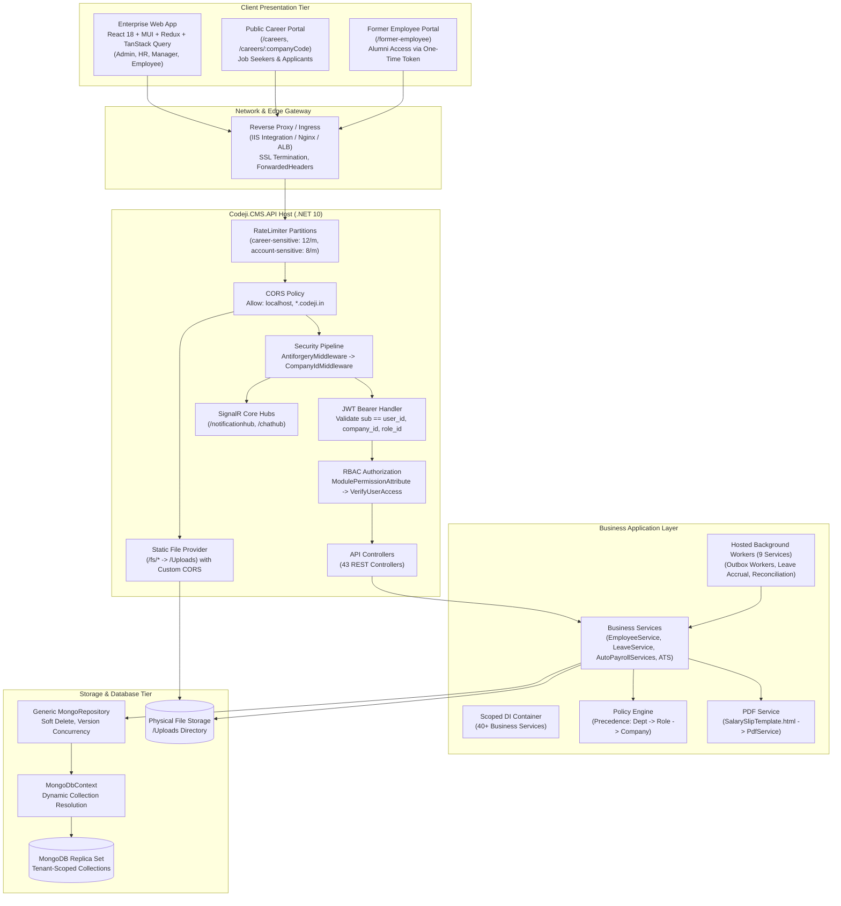

# System Context Architecture Diagram

```mermaid
flowchart TD
    subgraph Clients["Client Presentation Tier"]
        AdminBrowser["Enterprise Web App\nReact 18 + MUI + Redux + TanStack Query\n(Admin, HR, Manager, Employee)"]
        PublicCandidate["Public Career Portal\n(/careers, /careers/:companyCode)\nJob Seekers & Applicants"]
        FormerAlumni["Former Employee Portal\n(/former-employee)\nAlumni Access via One-Time Token"]
    end

    subgraph Network["Network & Edge Gateway"]
        Proxy["Reverse Proxy / Ingress\n(IIS Integration / Nginx / ALB)\nSSL Termination, ForwardedHeaders"]
    end

    subgraph ApiHost["Codeji.CMS.API Host (.NET 10)"]
        RateLimit["RateLimiter Partitions\n(career-sensitive: 12/m, account-sensitive: 8/m)"]
        Cors["CORS Policy\nAllow: localhost, *.codeji.in"]
        StaticFS["Static File Provider\n(/fs/* -> /Uploads) with Custom CORS"]
        Security["Security Pipeline\nAntiforgeryMiddleware -> CompanyIdMiddleware"]
        JwtFilter["JWT Bearer Handler\nValidate sub == user_id, company_id, role_id"]
        RbacAuth["RBAC Authorization\nModulePermissionAttribute -> VerifyUserAccess"]
        ApiControllers["API Controllers\n(43 REST Controllers)"]
        SignalRHubs["SignalR Core Hubs\n(/notificationhub, /chathub)"]
    end

    subgraph ServicesTier["Business Application Layer"]
        ServicesRegistration["Scoped DI Container\n(40+ Business Services)"]
        DomainServices["Business Services\n(EmployeeService, LeaveService, AutoPayrollServices, ATS)"]
        PolicyEngine["Policy Engine\n(Precedence: Dept -> Role -> Company)"]
        Workers["Hosted Background Workers (9 Services)\n(Outbox Workers, Leave Accrual, Reconciliation)"]
        PdfGen["PDF Service\n(SalarySlipTemplate.html -> PdfService)"]
    end

    subgraph Persistence["Storage & Database Tier"]
        MongoContext["MongoDbContext\nDynamic Collection Resolution"]
        MongoRepo["Generic MongoRepository<T>\nSoft Delete, Version Concurrency"]
        MongoDbCluster[("MongoDB Replica Set\nTenant-Scoped Collections")]
        FileStorage[("Physical File Storage\n/Uploads Directory")]
    end

    AdminBrowser --> Proxy
    PublicCandidate --> Proxy
    FormerAlumni --> Proxy

    Proxy --> RateLimit
    RateLimit --> Cors
    Cors --> StaticFS
    Cors --> Security
    Security --> JwtFilter
    JwtFilter --> RbacAuth
    RbacAuth --> ApiControllers
    Security --> SignalRHubs

    ApiControllers --> DomainServices
    DomainServices --> PolicyEngine
    DomainServices --> MongoRepo
    DomainServices --> PdfGen
    DomainServices --> FileStorage
    Workers --> DomainServices
    MongoRepo --> MongoContext
    MongoContext --> MongoDbCluster
    StaticFS --> FileStorage
```
