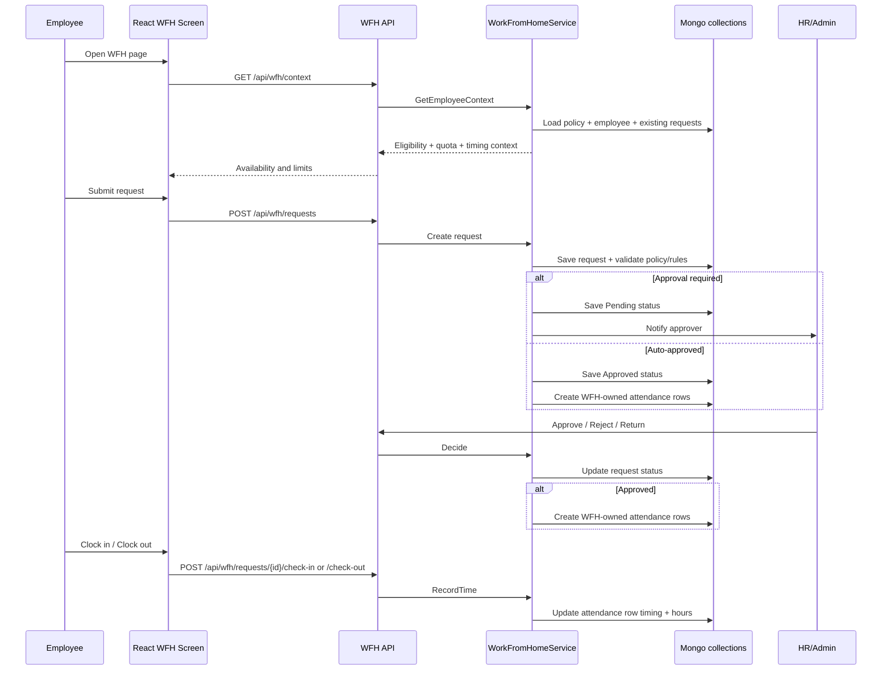

# WFH end-to-end flow for all employees

> This document explains how the current WFH workflow works across the backend and React UI for every employee. It focuses on the real implementation paths in the codebase rather than the intended business concept alone.

## 1. What WFH is in this system

### Typed Leave Policy integration

WFH can now be configured as an explicit `LeavePolicyType.WorkFromHome` policy. It is not identified from a name or code. A typed WFH policy stores its WFH-specific approval, quota, attendance-status, duration and schedule settings, and synchronizes those validated settings to the existing WFH request engine.

Normal `LeavePolicyType.Leave` policies retain their historic behaviour. WFH policies never create employee leave balances and are excluded from leave accrual. Ordinary Leave Apply requests reject a WFH policy and direct the caller to the protected WFH request workflow, which preserves WFH attendance ownership and clocking rules.

Legacy leave-policy documents are migrated explicitly to `Leave`; existing standalone WFH policy records remain readable during the transition and are linked when the typed WFH policy is configured.

Work From Home is not a free-form attendance status that employees can toggle manually. In this implementation, WFH is a policy-controlled leave-management workflow that:

- starts with an employee request;
- may require manager approval or can be auto-approved;
- creates a protected attendance row when approved; and
- optionally records employee clock-in and clock-out times for the approved day.

The feature is implemented by:

- API controller: [Codeji.CMS.API/Controllers/WorkFromHomeController.cs](../Codeji.CMS.API/Controllers/WorkFromHomeController.cs)
- Service logic: [Codeji.CMS.Services/Attendance/WorkFromHomeService.cs](../Codeji.CMS.Services/Attendance/WorkFromHomeService.cs)
- DTOs: [Codeji.CMS.DTO/Attendance/WorkFromHomeDto.cs](../Codeji.CMS.DTO/Attendance/WorkFromHomeDto.cs)
- Request/policy entities: [Codeji.CMS.Repository/Entities/Attendance/WorkFromHomeRequest.cs](../Codeji.CMS.Repository/Entities/Attendance/WorkFromHomeRequest.cs)
- React UI: [CMS-React/src/app/modules/attendance/WorkFromHome.tsx](../CMS-React/src/app/modules/attendance/WorkFromHome.tsx)

## 2. Main actors

### Employee
An employee can:

- view their own WFH eligibility and quota;
- create a WFH request;
- view their own request history;
- clock in/out for an approved WFH request covering today.

### Manager / assigned approver
If approval is required, the assigned approver can:

- approve;
- reject; or
- return the request.

### HR/Admin / company reviewer
HR/Admin can:

- configure the WFH policy;
- view company-wide requests;
- review approvals and related attendance outcomes.

## 3. Policy configuration

The company WFH policy is stored as a tenant-scoped policy and controls the behavior for all employees under that company.

Key policy options include:

- whether WFH is enabled;
- weekly limit (the implementation currently assumes one day per Monday–Sunday week);
- whether manager approval is required;
- whether half-day and mixed WFH/WFO are allowed;
- whether reasons are required;
- whether requests are allowed on weekly off or holiday;
- effective date range for the policy;
- minimum advance notice;
- allowed clock-in and clock-out windows;
- minimum hours for full-day and half-day requests;
- which attendance status codes represent full-day, half-day, and mixed WFH.

The policy can be applied to:

- all employees;
- selected departments;
- selected employee IDs; or
- a combination of the above.

## 4. How eligibility is decided

When an employee opens the WFH screen, the backend computes an employee-specific context through the WFH context endpoint.

The service checks:

1. whether the employee exists and is active in the company;
2. whether the WFH policy is enabled;
3. whether the employee is eligible by policy assignment;
4. whether the policy is effective for the current date;
5. how many WFH days the employee already used in the current Monday–Sunday week.

The UI uses this context to decide whether the employee can submit a new request.

### Common reasons a request is blocked

- WFH policy disabled
- employee not eligible for the current company profile
- weekly allowance used up
- request would overlap an existing WFH request
- request falls on a weekly off or holiday when not allowed
- attendance month is locked
- policy is not effective for the selected date range

## 5. Request lifecycle

### 5.1 Employee creates a request

The employee enters:

- from date;
- to date;
- duration type (full day, first half, second half, mixed);
- reason category and optional detail.

The backend validates the request before saving it.

### 5.2 Validation rules

The service checks the following before it allows the request:

- start date is not after end date;
- backdating is allowed only if policy permits it;
- required advance notice is met;
- a reason is provided when policy requires it;
- the duration type is supported;
- the policy is effective for the selected dates;
- the request does not overlap another active WFH request;
- the chosen dates do not exceed the weekly allowance;
- the dates satisfy working-day rules (weekly off / holiday / locked month).

### 5.3 Request status

The request status is stored as one of the workflow states:

- Draft
- Pending
- Approved
- Rejected
- Returned
- Cancelled

If manager approval is required, the request starts as Pending. If approval is not required, it is approved immediately.

### 5.4 Approval path

If manager approval is required:

- the request is routed to the assigned approver;
- the approver can approve, reject, or return it;
- the update is protected by a version number so concurrent changes do not silently overwrite each other.

If manager approval is not required:

- the request is auto-approved;
- the service immediately reconciles it into attendance.

## 6. How attendance is marked for WFH

This is the most important part of the flow.

WFH does not use the ordinary manual attendance editor. When an employee request is approved, the system creates or updates a daily attendance row that is owned by the WFH workflow.

### 6.1 What gets written to attendance

For every approved day covered by the request, the service creates or updates an attendance record with:

- CompanyId
- UserId
- EmployeeId
- Date
- Status = the configured WFH attendance code
  - full day: WFH
  - half day: WFH-HD
  - mixed: WFH+WFO
- SourceType = WFH_REQUEST
- SourceId = the WFH request ID
- SourceVersion = the request version
- RemarkCode = WFH_APPROVED

This makes the attendance row clearly identifiable as WFH-owned.

### 6.2 Why this matters

A WFH-created attendance row is protected from normal attendance editing. That means:

- HR/Admin cannot simply overwrite it using the ordinary attendance flow;
- manual attendance edits do not replace WFH attendance;
- payroll and monthly summaries consume the WFH attendance row as the authoritative day record.

If the system finds a conflicting existing attendance row that is not owned by WFH, it records a blocking exception instead of overwriting it.

### 6.3 What happens on conflict

If the day already has a conflicting attendance row, such as:

- a manual attendance row;
- a leave-owned row; or
- another workflow-owned row,

then the service creates a blocking payroll exception and stops the WFH reconciliation for that day.

This is a deliberate safety guard so the system does not silently destroy an existing attendance record.

## 7. How the employee marks attendance while working from home

Once the request is approved, the employee can clock in and out through the WFH screen.

### 7.1 Check-in

The employee can check in only if:

- the request is approved;
- the request covers today;
- the current time is within the configured check-in window;
- there is no existing WFH attendance row conflict.

The check-in stores:

- the server time;
- the WFH attendance row reference; and
- a remark that the check-in came from the employee WFH portal.

### 7.2 Check-out

Check-out requires:

- a prior check-in; and
- a valid check-out window.

When the employee checks out, the system:

- records check-out time;
- calculates total hours;
- compares the total hours to the configured minimum hours;
- creates a blocking exception if the minimum was not met.

### 7.3 Minimum-hours rule

If the employee does not work the configured minimum amount of time:

- the system does not silently change the day;
- it creates a pending blocking exception for review.

That ensures the attendance day is still traceable and payroll review can intervene.

## 8. What the UI does for the employee

The React page at [CMS-React/src/app/modules/attendance/WorkFromHome.tsx](../CMS-React/src/app/modules/attendance/WorkFromHome.tsx) gives employees a single place to:

- see whether WFH is available;
- submit a request;
- view personal request status;
- see the current day’s approved timing state;
- clock in or clock out.

The UI pulls the authoritative availability context from the backend and shows:

- remaining WFH days for the week;
- next availability date if the limit is already used;
- office hours and timing windows;
- the current worked hours for today.

## 9. What HR/Admin and managers see

### HR/Admin
HR/Admin can:

- configure the policy;
- view all company WFH requests;
- see the attendance impact of approved requests;
- review exceptions and attendance conflicts.

### Manager
A manager sees requests assigned to them when approval is required.

## 10. Audit trail and notifications

Every meaningful WFH action is logged in a request log entry. The service records:

- request creation;
- approval or rejection;
- cancellation;
- attendance reconciliation;
- check-in and check-out;
- conflict exceptions.

Notifications are also triggered for:

- new pending requests;
- direct approval without manager review;
- manager approval outcome;
- employee approval updates.

These notifications go through the in-app notification system and may also trigger emails if the recipient has a verified address.

## 11. End-to-end sequence

## 12. Practical summary

For the average employee, the WFH flow is:

1. open the WFH page;
2. check if the current week still has allowance;
3. submit a request for one or more dates;
4. wait for approval if approval is required, or have it auto-approved;
5. once approved, the system marks the day as WFH attendance in the attendance table;
6. optionally clock in and out for the day;
7. have the attendance row appear in payroll and monthly summary processing as a protected WFH day.

## 13. Key implementation invariants

The current implementation is designed around these rules:

- WFH is workflow-driven, not manually editable attendance.
- approved WFH creates protected attendance rows;
- manual attendance edits do not overwrite WFH-owned rows;
- weekly quota is enforced per Monday–Sunday week;
- monthly lock and holiday/weekly-off checks are enforced;
- the employee clocking flow uses server time and policy windows.
